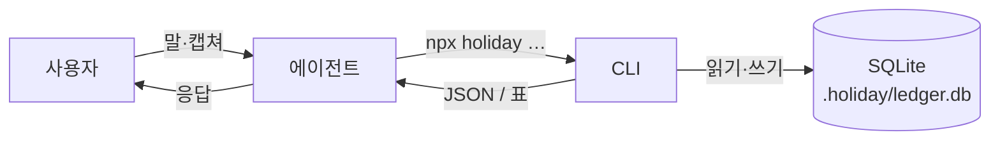
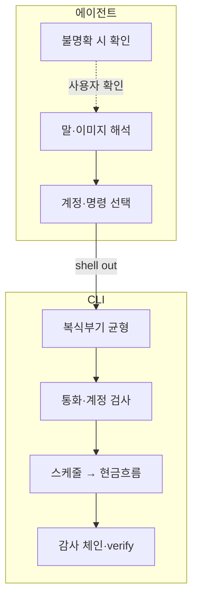
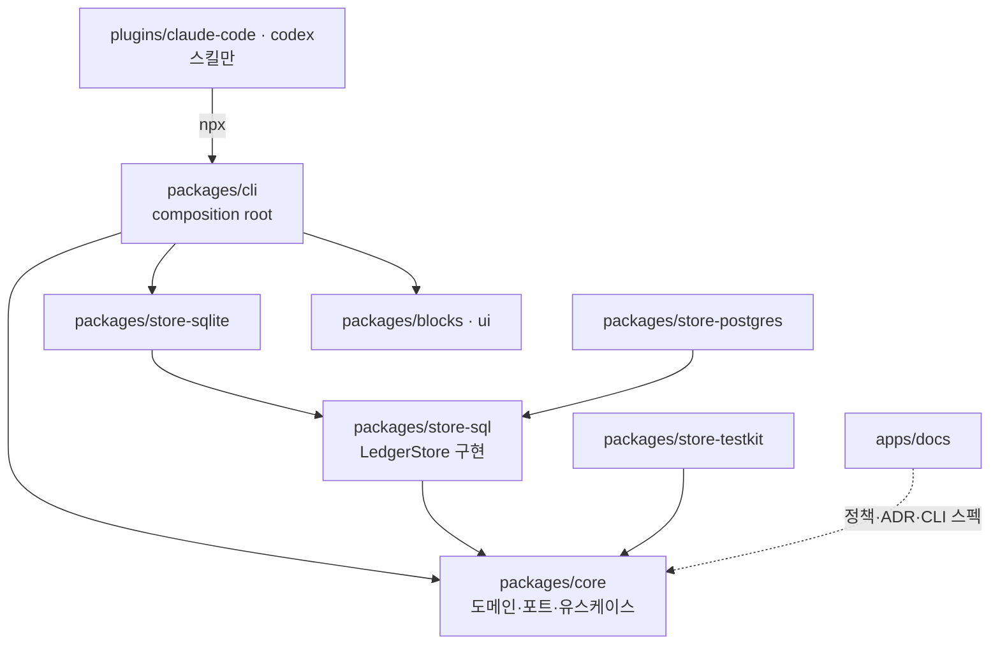

# holiday

1인용 복식부기 원장. 에이전트가 입력을 받고, CLI가 장부 규칙·통화·스케줄을 검증하며, 데이터는 로컬 SQLite에 둔다.

**v0.2.** 스키마와 CLI 계약은 아직 고정되지 않았다. 하위 호환을 깨는 변경이 있을 수 있다. 쓰려면 [시작하기](#시작하기)를 본다.

## 개요

`holiday`는 에이전트와 함께 쓰는 가계부 CLI다. Claude Code 또는 Codex에 지출·잔액·현금흐름을 물으면, 에이전트가 `holiday` CLI를 호출한다.

CLI 책임:

- 복식부기 균형 (`SUM(weight) === 0`, 허용오차 없음)
- 통화·계정 검증
- 카드·할부·정기지출·대출 스케줄을 현금흐름에 반영

에이전트는 영수증·명세를 해석하고 계정과 명령을 고른다. 금액을 추정하거나 불균형을 근사로 맞추지 않는다.

원장 경로는 작업 디렉터리의 `.holiday/ledger.db`다. 개인 금융 데이터라 **private git 저장소**에 둔다.

## 시작하기

요구 사항: **Node.js 24+**.

작업 디렉터리의 에이전트 채팅에 다음을 입력한다. 플러그인을 설치하면 원장 생성이 이어진다.

**Claude Code**

```
/plugin marketplace add ssota-labs/holiday-cfo
/plugin install holiday-cfo@holiday-cfo
이거를 기반으로 holiday-cfo 플러그인을 세팅하고, 가계부를 만들어줘.
```

**Codex**

```
codex plugin marketplace add ssota-labs/holiday-cfo
codex plugin install holiday-cfo
이거를 기반으로 holiday-cfo 플러그인을 세팅하고, 가계부를 만들어줘.
```

플러그인은 장부 스킬과 SessionStart 훅만 포함한다. 원장 CLI는 최초 실행 시
`npx @holiday-cfo/cli@latest`로 내려받는다.

엑셀·PDF·워드·슬라이드용 **문서 스킬**은 플러그인에 넣지 않는다. 셋업이 장부
프로젝트 폴더에 skills.sh로 설치한다 (`npx skills add … -y`, `-g` 없음). 세션이
열릴 때 같은 프로젝트만 `npx skills update -p -y`로 soft-fail 갱신한다. Cursor는
`holiday init`이 쓰는 `.cursor/hooks.json`을 본다. Codex는 플러그인 훅
trust가 필요할 수 있다. 계약:
[문서 스킬 companion](apps/docs/content/docs/agent/document-skills-companion.mdx).

이후 예시:

```
어제 스타벅스에서 카드로 6500원 썼어.
신한카드 청구주기 알려줄게 — 마감 14일, 결제 1일.
다음 분기 현금이 빠지는 날이 언제야?
이 카드 명세 캡쳐야. 읽어 줘.
```

<details>
<summary>프로젝트에 플러그인 고정</summary>

`.claude/settings.json`:

```json
{
  "extraKnownMarketplaces": {
    "holiday-cfo": {
      "source": { "source": "github", "repo": "ssota-labs/holiday-cfo" }
    }
  },
  "enabledPlugins": { "holiday-cfo": "holiday-cfo" }
}
```

이 디렉터리에서 Claude Code를 열면 플러그인 설치가 제안된다. 설치 후에는 자연어 요청만으로 원장을 다룬다.

</details>

<details>
<summary>CLI 직접 사용</summary>

```bash
npx @holiday-cfo/cli@latest init --currency KRW
npx @holiday-cfo/cli@latest account add Assets:Bank:KB:Checking --cash
npx @holiday-cfo/cli@latest cashflow --until 2026-10-31
npx @holiday-cfo/cli@latest verify
```

문서의 `holiday <command>`는 `npx @holiday-cfo/cli@latest <command>`와 동일하다. 도움말은 `holiday --help`. 정책과 CLI 스펙은 [`apps/docs`](apps/docs)에 있다.

</details>

## 어떻게 동작하는가

처리 흐름:



역할:



에이전트가 금액을 잘못 읽어도, 균형만 맞으면 CLI는 전표를 받는다. 스킬은 기록 전에 전표를 제시하고, 불확실한 값은 추측하지 않는다.

카드 청구·할부·정기지출·대출 스케줄은 원장 밖에 둔다. 예측을 분개하지 않기 때문에, 금리 변경이나 구독 해지가 과거 전표를 바꾸지 않는다.

## 왜 만들었나

일반 가계부 앱은 현재 잔액 위주다. 신용카드는 승인일과 출금일이 다르다. 할부는 회차로 나뉘고, 카드에 묶인 정기지출은 발생일이 아니라 결제일 기준으로 현금이 움직인다. 이 일정을 한 타임라인에 올려야 향후 현금 부족 시점을 볼 수 있다.

다통화도 같은 이유다. 환율을 되곱해 균형을 맞추면 반올림 오차가 생긴다. `holiday`는 전표마다 사실 금액(`units`)과 측정 금액(`weight`, 기능통화)을 저장하고, `SUM(weight_minor) === 0`만 강제한다. 단위당 환율(`@`)로 총액을 유도하지 않는다.

`cashflow`는 날짜 순 현금 전망을 출력한다. 잔고가 음수가 되는 날에는 `⚠ 부족`이 붙는다.

```
$ holiday cashflow --until 2026-10-31
현재 현금 (2026-07-17): 3000000 KRW

2026-07-25   -      800000   →      2200000
             월세                            800000
2026-08-25   -     2267052   →      1000000
             월세                            800000
             KB 주담대 (1/360)              1467052
2026-10-01   -      117000   →       -17000   ⚠ 부족
             냉장고 (2/12)                   100000
             넷플릭스 (2026-08-17 결제분)      17000

⚠ 2026-10-01에 17000 KRW가 부족합니다.
```

## 저장소 구성



| 경로 | 역할 |
|---|---|
| `packages/core` | 도메인, 포트, 유스케이스. 어댑터를 import하지 않는다 |
| `packages/store-sql` | `LedgerStore` 구현 (SQL 방언 독립) |
| `packages/store-sqlite` | `node:sqlite` 드라이버·스키마·PRAGMA |
| `packages/store-postgres` | Postgres 드라이버·스키마·plpgsql (테스트는 in-process pglite) |
| `packages/store-testkit` | 포트 적합성 스위트 |
| `packages/cli` | 진입점, dash 템플릿. npm `@holiday-cfo/cli` |
| `packages/blocks`, `packages/ui` | 대시보드 블록·shadcn primitive |
| `apps/docs` | 정책, ADR, CLI 스펙 (Fumadocs) |
| `plugins/claude-code`, `plugins/codex` | 호스트별 스킬. `references/`는 심링크 |

## 설계 원칙

상세와 채택하지 않은 대안은 [`apps/docs`](apps/docs)의 정책·ADR을 본다.

| 원칙 | 내용 |
|---|---|
| 의존 방향 | `core`는 외부 패키지를 import하지 않는다. 어댑터 factory는 `cli`만 안다 |
| 균형 | `SUM(weight_minor) === 0`. fuzz/epsilon 없음 |
| 금액 | i64 minor unit (`bigint`). JS `number`로 왕복하지 않는다 |
| 상대금액 | `@@`는 총액(weight). `@` 단위 환율 유도는 거부 |
| 스케줄 | 카드·할부·정기지출·대출은 예측이며 원장에 전기하지 않는다 |
| engine 티어 | 원자적 다중행 쓰기·UNIQUE·read-after-write가 없으면 engine이 될 수 없다 |
| 마이그레이션 | 적용된 마이그레이션은 수정하지 않는다. append만. 해시 변경 시 기존 원장을 열 수 없다 |
| CLI 배포 | 저장소에 번들을 커밋하지 않는다. 실행은 `npx @holiday-cfo/cli@latest` |

## 아직 없는 것

다음 기능은 제공하지 않는다.

- **OCR.** 이미지에서 숫자를 읽는 쪽은 에이전트다. CLI는 파싱된 값만 받는다. `ingest submit`은 에이전트가 읽은 것을 받고, 이미지는 해시 말고는 보지 않는다.
- **미분류 건의 자동 확정.** `rule add`로 매칭된 건은 바로 확정되지만, 미매칭 건은 분류 대기로 남아 대시보드 클릭이나 `review accept`를 기다린다. 금액·날짜를 추측으로 채우지 않는다.
- **할부수수료 공식.** 명세서의 회차별 수수료만 `--fees`로 받는다. 카드사 공식을 추정하지 않는다.
- **환율 자동 수집.** `holiday fx add`로 사용자가 넣은 시세만 쓴다. 외부 API를 호출하지 않으며, 없는 시세를 추정하지 않는다.
- **라이브 대시보드.** `holiday dash data`가 마지막으로 구운 JSON을 렌더한다. 원장을 실시간으로 열지 않는다. Codex Sites 같은 원격 정적 호스팅에서는 `ledger.db`를 열 수 없다.
- **18자리 ERC-20.** 금액이 i64이므로 ETH는 8자리로 자른다. 개인 순자산 추적에는 대체로 충분하고, 온체인 대사에는 맞지 않는다.

이 목록을 임의로 구현해 채우지 않는다. 없으면 이슈나 스펙으로 올린다.

## 기여

```bash
pnpm install
pnpm build
pnpm test
pnpm typecheck
pnpm lint
```

패키지 단위:

```bash
pnpm --filter @holiday-cfo/core test
pnpm --filter @holiday-cfo/store-sqlite test
pnpm --filter holiday-plugin test
pnpm --filter docs run check:rules
```

코드 변경은 [AGENTS.md](AGENTS.md)를 따른다. 채팅에서 원장을 다룰 때는 `plugins/claude-code/skills/holiday-cfo/` 또는 `plugins/codex/` 스킬을 본다. 커밋 메시지는 Conventional Commits (`feat:`, `fix:`, `docs:` 등)를 사용한다.

## 라이선스

[MIT](LICENSE.md) · Copyright (c) 2026 ssota-labs
