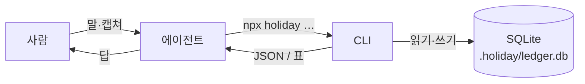
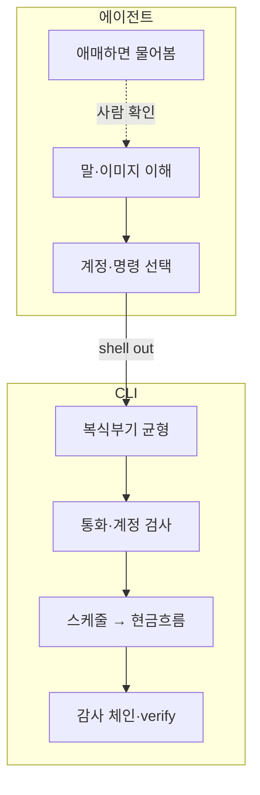
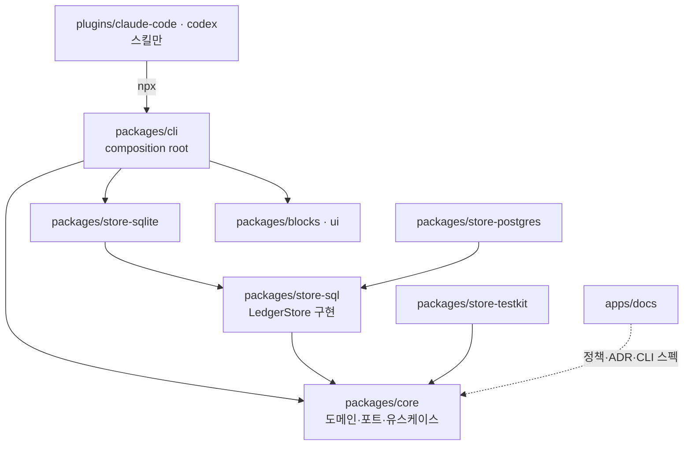

# holiday

채팅으로 가계부를 적는 1인용 복식부기 원장이다. 에이전트가 말을 듣고, CLI가 장부를 지키며, 데이터는 로컬 SQLite에 남는다.

지금은 **v0.1**이다. 스키마와 명령이 아직 굳지 않았다. 깨질 변경이 올 수 있다. 바로 쓰려면 [시작하기](#시작하기)로 가라.

## 개요

`holiday`는 사람이 직접 스프레드시트를 만지는 도구가 아니다. Claude Code나 Codex 같은 에이전트에게 "어제 커피 썼어", "다음 달 카드값 버티나"라고 말하면, 에이전트가 `holiday` CLI를 호출한다.

CLI가 맡는 일:

- 복식부기 균형 (`SUM(weight) === 0`, 허용오차 없음)
- 통화·계정 적합성
- 카드·할부·정기지출·대출 스케줄을 현금흐름으로 합치기

에이전트는 영수증을 읽고, 계정을 고르고, 명령을 친다. 숫자를 지어내거나 불균형을 "얼추" 맞추는 권한은 없다.

원장 파일은 작업 폴더의 `.holiday/ledger.db`다. 돈 기록이니 **비공개(private) git 저장소**에 두라.

## 시작하기

가계부로 쓸 폴더를 열고, 아래 **한 덩어리**를 채팅에 그대로 넣는다. 플러그인 설치와 원장 만들기가 이어진다.

**Claude Code**

```
/plugin marketplace add ssota-labs/holiday-cfo
/plugin install holiday-cfo@holiday-cfo
이거를 기반으로 holiday-cfo 플러그인을 세팅하고, 가계부를 만들어줘.
이 폴더는 private git 저장소로 두라고 알려줘.
원장은 KRW로 init하고, 주요 통장·신용카드를 하나씩 물어보면서 등록해줘.
카드는 마감일·결제일까지. 끝나면 지금 현금흐름을 보여줘.
```

**Codex** — 터미널에서 플러그인을 깐 뒤, 채팅에 나머지 말을 넣는다.

```bash
codex plugin marketplace add ssota-labs/holiday-cfo
codex plugin install holiday-cfo
```

```
holiday-cfo 플러그인을 기준으로 가계부를 만들어줘.
이 폴더는 private git 저장소로 두라고 알려줘.
원장은 KRW로 init하고, 주요 통장·신용카드를 하나씩 물어보면서 등록해줘.
카드는 마감일·결제일까지. 끝나면 지금 현금흐름을 보여줘.
```

**Node 24+**가 필요하다. 플러그인은 스킬만 싣고, 원장 CLI는 처음 쓸 때 `npx @holiday-cfo/cli@latest`로 받는다.

그다음부터는 일상 말로 충분하다.

```
어제 스타벅스에서 카드로 6500원 썼어.
신한카드 청구주기 알려줄게 — 마감 14일, 결제 1일.
다음 분기 현금이 빠지는 날이 언제야?
이 카드 명세 캡쳐야. 읽어 줘.
```

<details>
<summary>폴더에 플러그인을 미리 고정하기</summary>

가계부 폴더의 `.claude/settings.json`:

```json
{
  "extraKnownMarketplaces": {
    "holiday-cfo": {
      "source": { "source": "github", "repo": "ssota-labs/holiday-cfo" }
    }
  },
  "enabledPlugins": { "holiday-cfo": "holiday-cfo" }
}
```

이 폴더에서 Claude Code를 열면 설치가 뜬다. 뜬 뒤에는 위 프롬프트의 자연어 부분만 말해도 된다.

</details>

<details>
<summary>플러그인 없이 CLI만 쓰기</summary>

```bash
npx @holiday-cfo/cli@latest init --currency KRW
npx @holiday-cfo/cli@latest account add Assets:Bank:KB:Checking --cash
npx @holiday-cfo/cli@latest cashflow --until 2026-10-31
npx @holiday-cfo/cli@latest verify
```

문서에서 `holiday <명령>`이라고 쓰면 `npx @holiday-cfo/cli@latest <명령>`과 같다. 도움말은 `holiday --help`. 정책·명령 스펙은 [`apps/docs`](apps/docs)에 있다.

</details>

## 어떻게 동작하는가

사람 ↔ 에이전트 ↔ CLI ↔ 원장의 흐름:



역할은 이렇게 나뉜다.



에이전트가 금액을 잘못 읽으면 CLI는 막지 못한다. 균형만 맞으면 틀린 숫자도 들어간다. 그래서 스킬은 쓰기 전에 전표를 말로 보여 주고, 흐린 숫자는 추측하지 말라고 못 박는다.

스케줄(카드 청구, 할부, 정기지출, 대출)은 원장 밖에 산다. 예측을 전기하지 않는다. 금리가 바뀌거나 구독을 끊어도 과거 분개가 오염되지 않게 하려는 선택이다.

## 왜 만들었나

잔액 앱은 "지금 얼마"만 말한다. 한국 카드 생활에서는 그게 부족하다. 어제 긁은 돈이 언제 통장에서 빠지는지는 청구주기가 정한다. 할부는 회차로 나뉘고, 정기지출이 카드에 붙으면 발생일이 아니라 결제일을 탄다. 이 날짜들을 한 타임라인에 올려야 "다음 달 버티나"에 답할 수 있다.

다통화도 같은 이유로 처음부터 넣었다. 원화 통장과 달러 잔고를 같이 두면, 환율을 되곱해 균형을 맞추는 순간 반올림 구멍이 생긴다. `holiday`는 전기마다 사실 금액(`units`)과 측정 금액(`weight`, 기능통화)을 따로 두고, `SUM(weight_minor) === 0`만 지킨다. 단위당 환율(`@`)로 총액을 유도하지 않는다.

`cashflow`가 그 답을 날짜 순으로 보여 준다. 잔고가 음수로 가는 날에는 `⚠ SHORT`가 붙는다.

```
$ holiday cashflow --until 2026-10-31
cash on hand (2026-07-17):  3000000 KRW

2026-07-25   -      800000   →       2200000
             월세                                   800000
2026-10-01   -      117000   →        -17000   ⚠ SHORT
             냉장고 (2/12)                           100000
             넷플릭스 (2026-08-17 결제분)                 17000

⚠ Short by 17000 KRW on 2026-10-01.
```

잔액 숫자 하나가 아니라, **어느 날에 깨지는지**가 나온다.

## 저장소 구성



| 경로 | 역할 |
|---|---|
| `packages/core` | 도메인, 포트, 유스케이스. 바깥 어댑터를 import하지 않는다 |
| `packages/store-sql` | `LedgerStore` 구현 하나. SQL 방언과 무관 |
| `packages/store-sqlite` | `node:sqlite` 드라이버·스키마·PRAGMA |
| `packages/store-postgres` | Postgres 드라이버·스키마·plpgsql (테스트는 in-process pglite) |
| `packages/store-testkit` | 포트 적합성 스위트 |
| `packages/cli` | 진입점, dash 템플릿. npm `@holiday-cfo/cli` |
| `packages/blocks`, `packages/ui` | 대시보드 블록·shadcn primitive |
| `apps/docs` | 정책, ADR, CLI 스펙 (Fumadocs) |
| `plugins/claude-code`, `plugins/codex` | 호스트별 스킬. `references/`는 심링크 한 소스 |

## 설계 원칙

짧게만 적는다. 근거와 거부한 대안은 [`apps/docs`](apps/docs)의 정책·ADR에 있다.

| 원칙 | 한 줄 |
|---|---|
| 의존 방향 | `core`는 바깥을 import하지 않는다. factory는 `cli`만 안다 |
| 균형은 정확 | `SUM(weight_minor) === 0`. fuzz/epsilon 없음 |
| 금액은 i64 | minor unit `bigint`. JS `number`로 왕복하지 않는다 |
| 상대금액으로 균형 | `@@`는 총액(weight). `@` 환율 유도는 거부 |
| 스케줄 ≠ 원장 | 카드·할부·정기지출·대출은 예측. 전기하지 않는다 |
| engine 티어 | 원자적 다중행·UNIQUE·read-after-write를 못 하면 engine이 될 수 없다 |
| 마이그레이션 | 적용분은 수정 금지. append만. 해시가 바뀌면 옛 원장이 안 열린다 |
| CLI 배포 | 커밋된 번들 없음. 에이전트는 `npx @holiday-cfo/cli@latest` |

## 아직 없는 것

없다고 말하는 편이, 빈칸을 그럴듯하게 메우는 것보다 낫다.

- **OCR 없음.** 이미지를 숫자로 바꾸는 건 에이전트 모델이다. CLI는 파싱된 값만 받는다.
- **자동 승인 없음.** 드래프트·애매한 전표는 사람이 확인한다. 규칙 엔진으로 통과시키지 않는다.
- **할부수수료 공식 없음.** 명세서에 찍힌 회차별 수수료만 `--fees`로 받는다. 카드사 식을 추정하지 않는다.
- **환율 자동 수집 없음.** `holiday fx add`에 사람이 넣은 시세만 쓴다. API를 치지 않고, 없는 시세를 짐작하지도 않는다.
- **대시보드는 스냅샷.** `holiday dash data`가 마지막으로 구운 JSON을 그린다. 원장을 실시간으로 열지 않는다. 바꾼 뒤에는 다시 굽는다.
- **18자리 ERC-20은 표현 불가.** 금액이 i64라 ETH는 8자리로 자른다. 개인 순자산 추적에는 대체로 충분하고, 온체인 대사에는 맞지 않는다.

README의 이 목록을 즉흥으로 메우지 마라. 없으면 없다고 하거나 이슈·스펙으로 올려라.

## 기여

로컬에서:

```bash
pnpm install
pnpm build
pnpm test
pnpm typecheck
pnpm lint
```

패키지 단위 예:

```bash
pnpm --filter @holiday-cfo/core test
pnpm --filter @holiday-cfo/store-sqlite test
pnpm --filter holiday-plugin test
pnpm --filter docs run check:rules
```

코드를 고칠 때는 [AGENTS.md](AGENTS.md)를 본다. 채팅에서 원장을 운전할 때는 `plugins/claude-code/skills/holiday-cfo/`(또는 `plugins/codex/`) 스킬을 본다. 커밋 메시지는 Conventional Commits (`feat:`, `fix:`, `docs:` …).

## 라이선스

[MIT](LICENSE.md) · Copyright (c) 2026 ssota-labs
